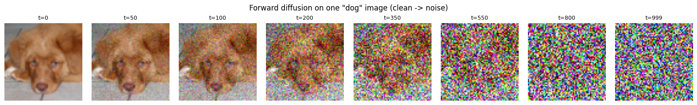
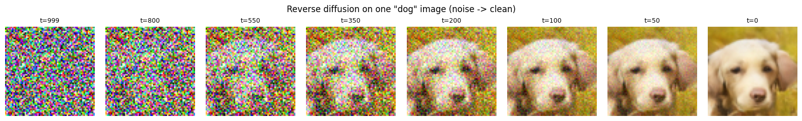
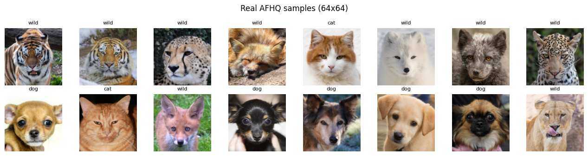
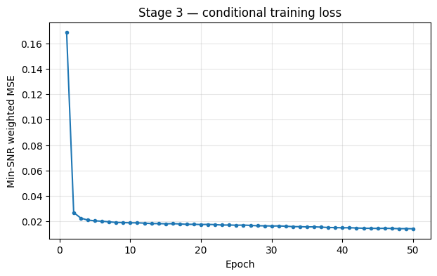
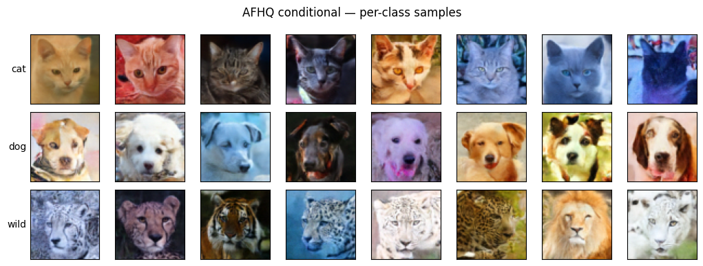
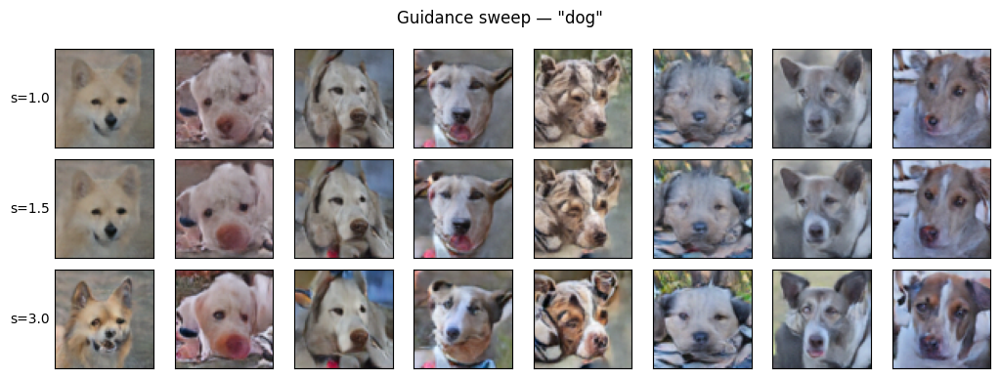

# Class-Conditional Diffusion Model
<br>

## Objective

The aim of this study is to understand the diffusion model and its processes in terms of
probabilistic reasoning, and to extend it from simple grayscale digits to **natural colour images**.
A class-conditional diffusion model is implemented from scratch and trained on animal faces, so that
the model can be *told which animal to draw*. Implementing the model, running a series of experiments,
and comparing their outcomes builds deeper knowledge of probability, inference, and the machine-learning
concepts behind modern generative models.
<br><br>

## The brief description of the diffusion model

The diffusion model is used to generate new data from its original data. It consists of two processes:
1. The forward process
2. The reverse process

### The forward process

The forward process adds Gaussian noise to the original data step by step, as shown in Fig. 1.


Fig. 1 Forward process — a real "dog" image is gradually corrupted into pure noise

X<sub>0</sub> is the original data, and X<sub>1</sub> is created by adding Gaussian noise to X<sub>0</sub>.
This action is repeated *t* times until X<sub>t</sub> is created. The final data X<sub>t</sub> is complete
noise — for an image, X<sub>t</sub> is an indistinguishable blur (see t = 999 above).

The main reason for using Gaussian noise is that it is smooth and continuous, with a mean of 0 and a
standard deviation of 1. It affects all features of the data only slightly, so each noisy version is
only slightly different from the previous one, and the original data changes gradually into complete
noise. This gradual, well-behaved corruption is what makes the denoising (reverse) action possible to
learn. Here a cosine (`squaredcos_cap_v2`) schedule controls *how fast* the noise is added.

### The reverse process

The reverse process tries to generate the original data from the noisy data X<sub>t</sub>, as shown in
Fig. 2.


Fig. 2 Reverse process — starting from noise and conditioning on "dog", a clean face emerges

Initially, the model forecasts the noise that was added during the forward process. Then it creates
X<sub>t-1</sub> by removing the predicted noise from X<sub>t</sub>. This denoising action is repeated
until the noise is removed. The output of the reverse process is *similar* to the original data but is
a **new** image, because the predicted noise differs slightly from the noise added in the forward
process — so a different, plausible animal face is produced each time.
<br><br>

## Data Source

The model is trained on the **Animal Faces-HQ (AFHQ)** dataset, which contains aligned, front-facing
animal faces in three classes — **cat**, **dog**, and **wild**. The training split holds **16,130
images** (5,653 cat / 5,239 dog / 5,238 wild), accessed through the HuggingFace Hub
([`huggan/AFHQ`](https://huggingface.co/datasets/huggan/AFHQ)). Images are resized to **64×64** and
normalised to the range [-1, 1]. A labelled sample of the real data is shown in Fig. 3.


Fig. 3 Real AFHQ samples (64×64)
<br><br>

## Deep Learning

### Model Building

In this study a **U-Net** (`UNet2DModel` from HuggingFace `diffusers`) is used to predict the noise at
each step. It has five resolution levels (64 → 32 → 16 → 8 → 4) with two residual blocks per level and
**self-attention at the 16×16 and 8×8 stages**, giving about **126.5M parameters**. Skip connections
carry fine detail from the encoder (downsampling) path to the decoder (upsampling) path.

The model can be trained both **conditionally** and **unconditionally**. Unconditional generation means
the model sees images without their labels and learns the general rule — it produces *some* animal but
cannot be told which. Conditional generation feeds the class label as a learned embedding, so the model
learns a separate rule for each class. To support **classifier-free guidance (CFG)**, the label of
about 10% of images is randomly dropped and replaced with a special "no-class" token (a 4th class
alongside cat/dog/wild). The model therefore learns both the conditional and unconditional behaviours at
once, and at sampling time the two are combined to steer the output toward the requested class.

| Component | Setting |
|---|---|
| Architecture | U-Net, 5 levels (64→32→16→8→4), attention at 16×16 and 8×8 |
| Channels | (128, 256, 384, 512, 512), 2 blocks per level — ~126.5M params |
| Conditioning | 3 classes + 1 "no-class" token for CFG |
| Diffusion | 1000 timesteps, cosine (`squaredcos_cap_v2`) schedule, ε-prediction |
| Optimiser | AdamW, lr 2e-4, warmup + cosine decay, gradient clipping, fp16 |
| Stabilisation | EMA weights, Min-SNR-γ loss weighting (γ = 5.0) |
| Sampling | DDIM, 100–200 steps, guidance scale 1.5 |

### Evaluation Metrics

The **mean squared error (MSE)** between the actual added noise and the predicted noise is used as the
loss (weighted by Min-SNR-γ). Fig. 4 shows the loss falling over training.



Fig. 4 Conditional training loss per epoch

The loss dropped sharply from **0.169** (epoch 1) to about **0.027** by epoch 2, then decreased slowly
to **0.0143** by epoch 50. The curve is smooth with no spikes, indicating stable training. Most of the
learning happened in the first ~20 epochs, after which the loss flattened — further epochs gave only
small refinements at this resolution.

### Model Performance

The identifiable images in Fig. 5 were generated after several experiments varying the number of epochs,
batch size, model base channels, learning rate, and noise schedule. Each row corresponds to a requested
class, confirming that the model can be **told what to draw**.


Fig. 5 Generated images, one row per class (cat / dog / wild)

**Classifier-free guidance** controls how strongly the output is pushed toward the requested class.
Fig. 6 sweeps the guidance scale for the "dog" class. Lower guidance gives softer, more varied images;
higher guidance gives crisper, more "typical" ones but eventually over-saturates and loses variety.
A value around **1.5** is a good middle ground.


Fig. 6 Guidance sweep for "dog" (scale = 1.0 / 1.5 / 3.0)
<br><br>

## Conclusion

This project studied diffusion models and how noise is progressively added to and then removed from
images to generate new samples. Moving from grayscale digits to natural colour animal faces, a
class-conditional model was implemented and trained, and several configurations (epochs, model size,
guidance strength, and noise schedule) were examined to see how they affect image quality. The findings
show that the conditional model with classifier-free guidance can reliably generate a chosen class, that
a larger model and a cosine noise schedule produce clearer results, and that most learning happens
early in training. At 64×64 the outputs are clean and clearly recognisable rather than photoreal, which
sets an honest ceiling on sharpness — higher resolution is the main lever for further quality. Overall,
diffusion models worked well for image generation and offered insightful information about probability,
inference, and machine-learning model concepts.
<br><br>

## How to use

```bash
pip install -r requirements.txt
```

Open [`notebook/afhq_diffusion.ipynb`](notebook/afhq_diffusion.ipynb) and run it top-to-bottom; the
dataset downloads automatically. A CUDA GPU is recommended. After training, generate images with:

```python
draw("cat",  n=8)   # 8 cats
draw("dog",  n=8)   # 8 dogs
draw("wild", n=8)   # 8 wild animals
```

> Trained weights (`afhq_cond_final.pt`, ~480 MB) are not committed; re-run the training cells to
> reproduce them, or host them via a GitHub Release / HuggingFace Hub.
<br><br>

## Reference

- J. Ho, A. Jain, and P. Abbeel, "Denoising Diffusion Probabilistic Models," *NeurIPS*, 2020.
  https://arxiv.org/abs/2006.11239
- J. Ho and T. Salimans, "Classifier-Free Diffusion Guidance," 2022. https://arxiv.org/abs/2207.12598
- T. Hang et al., "Efficient Diffusion Training via Min-SNR Weighting Strategy," *ICCV*, 2023.
  https://arxiv.org/abs/2303.09556
- Y. Choi, Y. Uh, J. Yoo, and J.-W. Ha, "StarGAN v2: Diverse Image Synthesis for Multiple Domains"
  (AFHQ dataset), *CVPR*, 2020. https://github.com/clovaai/stargan-v2
- HuggingFace `diffusers` library. https://github.com/huggingface/diffusers
